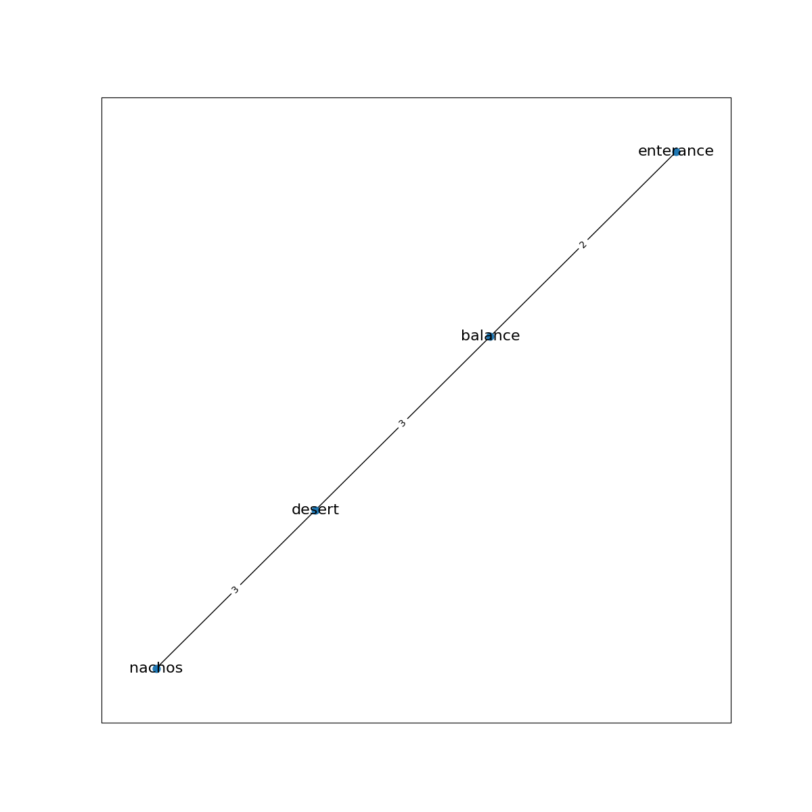
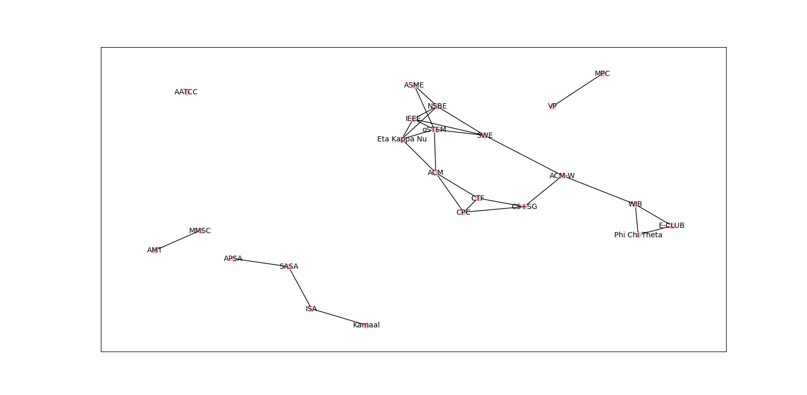

# University of Delaware Graphs
## Theme: Campus Life

**CISC320 Spring 2023 Lesson 19 - Graph Applications**

Group Members:
* First member: Sean Johnson, (seanjohn@udel.edu)
* Second member: Joy Mwaria (jkmwaria@udel.edu)
* Third member: Benita Abraham (beniabra@udel.edu)
* Fourth member (email)

Description of project

## Installation Code

```sh
$> pip install networkx
$> pip install matplotlib
```

## Python Environment Setup

```python
import networkx as nx
import matplotlib.pyplot as plt
```

## Additional sources
[node labels](https://stackoverflow.com/questions/14547388/networkx-in-python-draw-node-attributes-as-labels-outside-the-node)

### Minimal Brick Walkways

**Informal Description**: 
The problem: The sidewalks to the library at UD have been declared unfit for use due to wear and decay. The university wants to build brick walkways this time instead, but they're very expensive! The university has many interconnected sidewalks, but this is too expensive to do for brick walkways, so UD wants to have the minimum number of walkways in order to get from some of the buildings on campus to the library. As the engineer contracted by UD your job is to cut costs to a minimum for the university. You are to use the smallest amount of bricks possible (A length of 1 in the context of the problem is equivalent to a 100ft length walkway of bricks) in order to make sure every major building has a path to the library. You are also using the previous network of interconnected sidewalks(the visualized graph) to decide where to place your brick walkways.

> **Formal Description**:
>  * Input: A connected, undirected, weighted graph with at least 20 vertices, with the vertices being buildings at UD, the edges being sidewalks between them, and the edge weights being the length of that walkway (1 = 100ft)
>  * Output: The minimum spanning tree of that graph

**Graph Problem/Algorithm**: MST/Prim's


**Setup code**:

```python
graph = {
    'L': {'KB': {'weight': 4}, 'SH': {'weight': 8}, 'MH': {'weight': 1}, 'CR': {'weight': 4},
               'AHW': {'weight': 2}, 'AH': {'weight': 2}, 'TH': {'weight': 9}},
    'KB': {'PL': {'weight': 4}, 'EW': {'weight': 2}, 'TB': {'weight': 3}, 'SH': {'weight': 2}},
    'TB': {'WHS': {'weight': 6}, 'MD': {'weight': 7}, 'SH': {'weight': 4}, 'EW': {'weight': 4}},
    'MD': {'IW': {'weight': 10}, 'IE': {'weight': 10}, 'WHS': {'weight': 2}},
    'IE': {'IW': {'weight': 1}},
    'WHS': {'EW': {'weight': 5}, 'IW': {'weight': 13}},
    'EW': {'PL': {'weight': 1}},
    'PL': {'SH': {'weight': 4}},
    'SH': {'ISE': {'weight': 6}, 'PH': {'weight': 4}, 'GH': {'weight': 2}},
    'ISE': {'PH': {'weight': 3}},
    'PH': {'SL': {'weight': 4}},
    'SL': {'GH': {'weight': 1}},
    'GH': {'MH': {'weight': 2}, 'MH': {'weight': 3}},
    'AH': {'AHW': {'weight': 1}, 'TH': {'weight': 5}, 'PK': {'weight': 4}, 'CR': {'weight': 3}},
    'CR': {'LN': {'weight': 4}, 'PK': {'weight': 2}},
    'PK': {'LN': {'weight': 2}, 'TH': {'weight': 2}},
    'TH': {'LN': {'weight': 1}},
    'MH': {'TB': {'weight': 10}, 'PH': {'weight': 6}}
               }
"""
Meanings: L = Library, KB = Kirkrbide hall, SH = Smith hall, MH = Memorial hall, CR = Ceasar Rodney dining hall, AH = Allison hall, AHW = Allison hall west, TH = Thompson hall, LN = Lane hall, PL = Pernell hall, EW = Ewing hall TB = Trabant, WHS = Willard educational hall, MD = McDowell hall, IE = Independence east, IW = Independence west, PH = Pearson hall, SL = Sharp lab, PK = Perkins, GH = Gore hall, ISE = Harker lab
"""

G = nx.from_dict_of_dicts(graph)

pos = nx.spring_layout(G, seed=4)
labels = nx.get_edge_attributes(G,'weight')
plt.figure(1,figsize=(12,12)) 
nx.draw_networkx(G,pos, node_size=70, node_color = "yellow", font_size=14, font_color = "red")
nx.draw_networkx_edge_labels(G,pos,edge_labels=labels)
plt.savefig("initial_graph.png")


```

**Visualization**:


**Solution code:**

```python
H = nx.algorithms.minimum_spanning_tree(G, weight = "weight", algorithm = "prim", ignore_nan = False)

pos = nx.spring_layout(H, seed=4)
labels = nx.get_edge_attributes(H,'weight')
plt.figure(2,figsize=(12,12)) 
nx.draw_networkx(H,pos, node_size=70, node_color = "yellow", font_size=14, font_color = "red")
nx.draw_networkx_edge_labels(H,pos,edge_labels=labels)
plt.savefig("minimum_spanning_tree")

```

**Output**


**Interpretation of Results**:
The resulting subgraph is the minimum spanning tree, which is the subgraph with the least total edge weight while still visiting all the vertices. In the context of this problem, it is the graph of the brick walkway network to each UD building on the graph. This graph uses the least amount of bricks possible and has a way to get from every vertex to the library. 

---
### Rush Through Dining Hall

**Informal Description:**
The problem: You enter Ceasar Rodney Dining Hall from Academy Street, but they are serving your favorite meal all the way on the other side of the dining hall. It is dinner time so the dining hall is packed. You need need to find the quickest way to get to your desired food station so you won't be late to your next class. Thankfully, the dining hall displays the amount of student traffic between different stations in the dining hall on a TV at the enterance.

> **Formal Description:**
>  * Input: A connected, undirected, weighted graph with at least 20 vertices, with the vertices being food stations in the dining hall, the edges being the paths between stations, and the edge weights being the traffic (number of students in the way) between stations
>  * Output: A graph of the shortest path to the nachos station

**Graph Problem/Algorithm:** Dijkstra's

**Setup code:**
```python
graph1 = {
    'enterance': {'home': {'weight': 4}, 'balance': {'weight': 2}, 'salad': {'weight': 1}},
    'home': {'kosher': {'weight': 2}, 'grill': {'weight': 5}, 'coffee': {'weight': 1}},
    'balance': {'desert': {'weight': 3}, 'vegan': {'weight': 1}},
    'salad': {'infused water': {'weight': 2}, 'wrap': {'weight': 2}, 'panini': {'weight': 2}, 'vegan': {'weight': 1}, 'fruit bar': {'weight': 3}},
    'kosher': {'halal': {'weight': 3}},
    'grill': {'sizzling': {'weight': 3}, 'nachos': {'weight': 2}, 'desert': {'weight': 1}},
    'coffee': {'cereal': {'weight': 1}},
    'desert': {'fruit bar': {'weight': 1}, 'icecream': {'weight': 3}, 'nachos': {'weight': 3}},
    'vegan': {},
    'fruit bar': {'smoothie': {'weight': 1}},
    'infused water': {},
    'wrap': {'panini': {'weight': 1}},
    'panini': {},
    'halal': {'sizzling': {'weight': 5}},
    'sizzling': {'pizza': {'weight': 6}},
    'nachos': {'soda': {'weight': 3}},
    'icecream': {'smoothie': {'weight': 4}},
    'cereal': {},
    'soda': {},
    'smoothie': {},
    'pizza': {}
}

#Actual graph
G1 = nx.from_dict_of_dicts(graph1)

pos = nx.spring_layout(G1, seed=4)
labels = nx.get_edge_attributes(G1,'weight')
plt.figure(1,figsize=(12,12)) 

pos_higher = {}
y_off = 0.04  # offset on the y axis
x_off = 0.03  # offset on the x axis

for k, v in pos.items():
    pos_higher[k] = (v[0]+x_off, v[1]+y_off)

nx.draw_networkx(G1,pos, node_size=60, with_labels=False)
nx.draw_networkx_labels(G1, pos_higher, font_size=8)
nx.draw_networkx_edge_labels(G1,pos,edge_labels=labels, font_size=8)
plt.savefig("initial_graph1.png")
```

**Visualization:**


**Solution code:**
```python
H1 = nx.shortest_path(G1, source='enterance', target='nachos', weight='weight', method='dijkstra')

short_graph = {}
now = H1[0]
for node in H1[1:]:
    short_graph[now] = {node: {'weight': graph1[now][node]['weight'] }}
    now = node

H2 = nx.from_dict_of_dicts(short_graph)

pos = nx.spring_layout(H2, seed=4)
labels = nx.get_edge_attributes(H2,'weight')
plt.figure(1,figsize=(12,12)) 
nx.draw_networkx(H2,pos, node_size=60, font_size=16)
nx.draw_networkx_edge_labels(H2,pos,edge_labels=labels)
plt.savefig("path_graph1.png")
```

**Output:**


**Interpretation of Results:**
The result is a graph showing the path with the least total traffic (least total edge weight), from the enterance to the students desired food station (nacho station). In the conetxt of the problem, this is the path the students can reach the nacho station the quickest.

---
### Club Membership Connected Component

**Informal Description**: 
The CS + Social Good (CS+SG) club is looking to collaborate with another club
for their next social good project. They're looking to collaborate with a club that that they have some connection with whether it be through a club member or a club member's other clubs. In this way, it won't be that difficult to work with them. They want to generate a list of potential clubs that they could collaborate with based on a connection (path) existing between the two clubs. Their faculty advisor provided them with a graph based on survey data collected directly from UD students. 

> **Formal Description**:
>  * Input: A disconnected, undirected, unweighted graph with at least 20 vertices, with the vertices being clubs/organizations at UD, the edges being at least one student that is a member of both clubs.
>  * Output: A list of nodes in the connected component containing the node 'CS+SG'

**Graph Problem/Algorithm**: BST


**Setup code**:

```python
G = nx.Graph()

""" Adding all 20 nodes"""
G.add_node("CS+SG") # Computer Science + Social Good
G.add_node("ACM") # Association for Computing Machinery
G.add_node("ACM-W") # Association for Computing Machinery - Council on Women
G.add_node("CPC") # Competitive Programming Club
G.add_node("CTF") # Blue Hens Capture The Flag
G.add_node("oSTEM") # Out in Science, Technology, Engineering, and Mathematics
G.add_node("MPC") # Music Production Club
G.add_node("Eta Kappa Nu") # Electrical & Computer Engineering
G.add_node("AMT") # Assistive Medical Technologies
G.add_node("AATCC") # Fashion x Textiles
G.add_node("IEEE") # Institute of Electrical and Electronics Engineers
G.add_node("WIB") # Women in Business
G.add_node("SWE") # Society of Women Engineers
G.add_node("Phi Chi Theta") # Co-ed business fraternity
G.add_node("E-CLUB") # Entrepreneurship Club
G.add_node("NSBE") # National Society of Black Engineers
G.add_node("ISA") # Indian Student Association
G.add_node("APSA") # Asian & Pacific Islander Student Association
G.add_node("SASA") # South Asian Student Association
G.add_node("ASME") # American Society of Mechanical Engineers
G.add_node("MMSC") # Medical and Molecular Sciences Club
G.add_node("Kamaal") # Dance group
G.add_node("VP") # Vocal Point


"""Adding all edges"""
G.add_edge("CS+SG","ACM-W")
G.add_edge("CS+SG","CPC")
G.add_edge("CS+SG","CTF")
G.add_edge("ACM-W","WIB")
G.add_edge("ACM","oSTEM")
G.add_edge("ACM","Eta Kappa Nu")
G.add_edge("CPC","ACM")
G.add_edge("NSBE","SWE")
G.add_edge("oSTEM","SWE")
G.add_edge("IEEE","SWE")
G.add_edge("CPC","CTF")
G.add_edge("oSTEM","ASME")
G.add_edge("oSTEM","Eta Kappa Nu")
G.add_edge("oSTEM","IEEE")
G.add_edge("IEEE","Eta Kappa Nu")
G.add_edge("WIB","Phi Chi Theta")
G.add_edge("WIB","Phi Chi Theta")
G.add_edge("ISA","SASA")
G.add_edge("E-CLUB","Phi Chi Theta")
G.add_edge("NSBE","ASME")
G.add_edge("NSBE","IEEE")
G.add_edge("NSBE","Eta Kappa Nu")
G.add_edge("WIB","E-CLUB")
G.add_edge("CTF","ACM")
G.add_edge("Kamaal","ISA")
G.add_edge("SASA","APSA")
G.add_edge("VP","MPC")
G.add_edge("ACM-W","SWE")
G.add_edge("MMSC","AMT")

"""Drawing the graph"""
pos = nx.spring_layout(G, seed=4)
labels = nx.get_edge_attributes(G,'weight')
plt.figure(1,figsize=(12,12)) 
nx.draw_networkx(G,pos, node_size=60, font_size=8)
nx.draw_networkx_edge_labels(G,pos,edge_labels=labels)
plt.savefig("club_graph.png")
plt.show()
```

**Visualization**:



**Solution code:**

```python
edges = nx.bfs_edges(G, 'CS+SG')
nodes = ['CS+SG'] + [v for u, v in edges]
for i in nodes:
    print(i)

```

**Output**

```
CS+SG
ACM-W
CPC
CTF
WIB
SWE
ACM
Phi Chi Theta
E-CLUB
NSBE
oSTEM
IEEE
Eta Kappa Nu
```

**Interpretation of Results**:
The solution presents all of the clubs that are in the connected component that contains CS+SG. 

