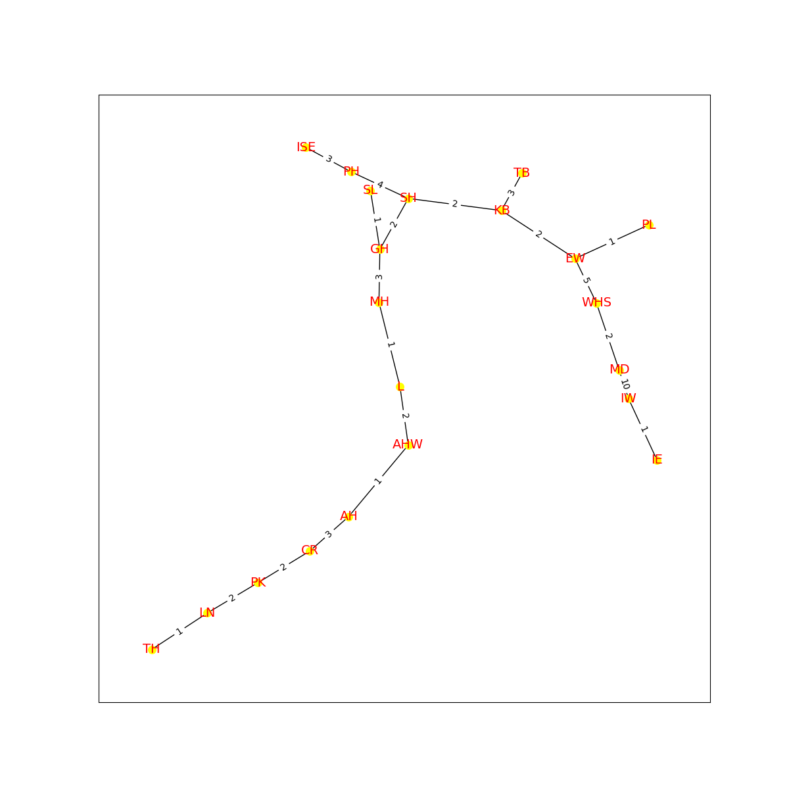
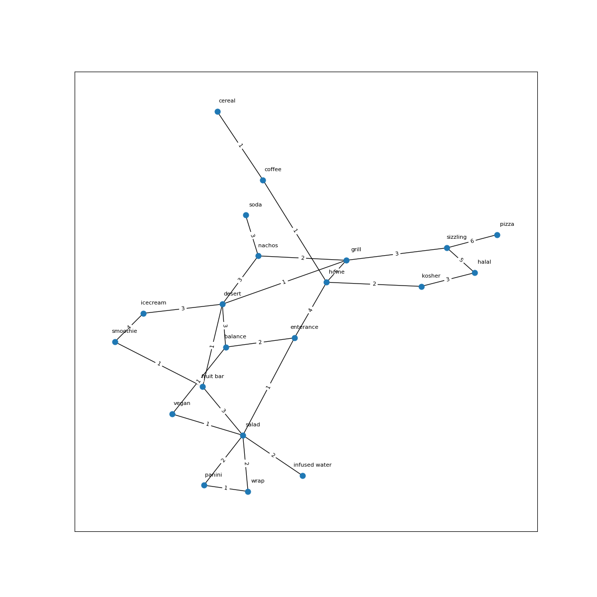

# University of Delaware Graphs
## Theme: Campus Life

**CISC320 Spring 2023 Lesson 19 - Graph Applications**

Group Members:
* First member: Sean Johnson, (seanjohn@udel.edu)
* Second member: Joy Mwaria (jkmwaria@udel.edu)
* Third member (email)
* Fourth member (email)

Description of project

## Installation Code

```sh
$> pip install networkx
$> pip install matplotlib
```

## Python Environment Setup

```python
import networkx as nx
import matplotlib.pyplot as plt
```

### Minimal Brick Walkways

**Informal Description**: 
The problem: The sidewalks to the library at UD have been declared unfit for use due to wear and decay. The university wants to build brick walkways this time instead, but they're very expensive! The university has many interconnected sidewalks, but this is too expensive to do for brick walkways, so UD wants to have the minimum number of walkways in order to get from the buildings on campus to the library. As the engineer contracted by UD your job is to cut costs to a minimum for the university. You are to use the smallest amount of bricks possible   (A length of 1 in the context of the problem is equivalent to a 100ft length walkway of bricks) in order to make sure every major building has a path to the library. You are also using the previous network of interconnected sidewalks(the visualized graph) to decide where to place your brick walkways.

> **Formal Description**:
>  * Input: A connected, undirected, weighted graph with at least 20 vertices, with the vertices being buildings at UD, the edges being sidewalks between them, and the edge weights being the length of that walkway (1 = 100ft)
>  * Output: The minimum spanning tree of that graph

**Graph Problem/Algorithm**: MST/Prim's


**Setup code**:

```python
graph = {
    'L': {'KB': {'weight': 4}, 'SH': {'weight': 8}, 'MH': {'weight': 1}, 'CR': {'weight': 4},
               'AHW': {'weight': 2}, 'AH': {'weight': 2}, 'TH': {'weight': 9}},
    'KB': {'PL': {'weight': 4}, 'EW': {'weight': 2}, 'TB': {'weight': 3}, 'SH': {'weight': 2}},
    'TB': {'WHS': {'weight': 6}, 'MD': {'weight': 7}, 'SH': {'weight': 4}, 'EW': {'weight': 4}},
    'MD': {'IW': {'weight': 10}, 'IE': {'weight': 10}, 'WHS': {'weight': 2}},
    'IE': {'IW': {'weight': 1}},
    'WHS': {'EW': {'weight': 5}, 'IW': {'weight': 13}},
    'EW': {'PL': {'weight': 1}},
    'PL': {'SH': {'weight': 4}},
    'SH': {'ISE': {'weight': 6}, 'PH': {'weight': 4}, 'GH': {'weight': 2}},
    'ISE': {'PH': {'weight': 3}},
    'PH': {'SL': {'weight': 4}},
    'SL': {'GH': {'weight': 1}},
    'GH': {'MH': {'weight': 2}, 'MH': {'weight': 3}},
    'AH': {'AHW': {'weight': 1}, 'TH': {'weight': 5}, 'PK': {'weight': 4}, 'CR': {'weight': 3}},
    'CR': {'LN': {'weight': 4}, 'PK': {'weight': 2}},
    'PK': {'LN': {'weight': 2}, 'TH': {'weight': 2}},
    'TH': {'LN': {'weight': 1}},
    'MH': {'TB': {'weight': 10}, 'PH': {'weight': 6}}
               }

G = nx.from_dict_of_dicts(graph)

pos = nx.spring_layout(G, seed=4)
labels = nx.get_edge_attributes(G,'weight')
plt.figure(1,figsize=(12,12)) 
nx.draw_networkx(G,pos, node_size=60, font_size=8)
nx.draw_networkx_edge_labels(G,pos,edge_labels=labels)
plt.savefig("initial_graph.png")


```

**Visualization**:


**Solution code:**

```python
H = nx.algorithms.minimum_spanning_tree(G, weight = "weight", algorithm = "prim", ignore_nan = False)

pos = nx.spring_layout(H, seed=4)
labels = nx.get_edge_attributes(H,'weight')
plt.figure(2,figsize=(12,12)) 
nx.draw_networkx(H,pos, node_size=60, font_size=8)
nx.draw_networkx_edge_labels(H,pos,edge_labels=labels)
plt.savefig("minimum_spanning_tree")

```

**Output**



**Interpretation of Results**:
The resulting subgraph is the minimum spanning tree, which is the subgraph with the least total edge weight while still visiting all the vertices. In the context of this problem, it is the graph of the brick walkway network to each UD building on the graph. This graph uses the least amount of bricks possible and has a way to get from every vertex to the library. 

--------------------------------------------------------------------------------------------------------------------------------------------------

### Rush Through Dining Hall

**Informal Description:**
The problem: You enter Ceasar Rodney Dining Hall from Academy Street, but they are serving your favorite meal all the way on the other side of the dining hall. It is dinner time so the dining hall is packed. You need need to find the quickest way to get to your desired food station so you won't be late to your next class. Thankfully, the dining hall displays the amount of student traffic between different stations in the dining hall on a TV at the enterance.

> **Formal Description:**
>  * Input: 
>  * Output: 

**Graph Problem/Algorithm:** Dijkstra's

**Setup code:**
```python
graph1 = {
    'enterance': {'home': {'weight': 4}, 'balance': {'weight': 2}, 'salad': {'weight': 1}},
    'home': {'kosher': {'weight': 2}, 'grill': {'weight': 5}, 'coffee': {'weight': 1}},
    'balance': {'desert': {'weight': 3}, 'vegan': {'weight': 1}},
    'salad': {'infused water': {'weight': 2}, 'wrap': {'weight': 2}, 'panini': {'weight': 2}, 'vegan': {'weight': 1}, 'fruit bar': {'weight': 3}},
    'kosher': {'halal': {'weight': 3}},
    'grill': {'sizzling': {'weight': 3}, 'nachos': {'weight': 2}, 'desert': {'weight': 1}},
    'coffee': {'cereal': {'weight': 1}},
    'desert': {'fruit bar': {'weight': 1}, 'icecream': {'weight': 3}, 'nachos': {'weight': 3}},
    'vegan': {},
    'fruit bar': {'smoothie': {'weight': 1}},
    'infused water': {},
    'wrap': {'panini': {'weight': 1}},
    'panini': {},
    'halal': {'sizzling': {'weight': 5}},
    'sizzling': {'pizza': {'weight': 6}},
    'nachos': {'soda': {'weight': 3}},
    'icecream': {'smoothie': {'weight': 4}},
    'cereal': {},
    'soda': {},
    'smoothie': {},
    'pizza': {}
}

#Actual graph
G1 = nx.from_dict_of_dicts(graph1)

pos = nx.spring_layout(G1, seed=4)
labels = nx.get_edge_attributes(G1,'weight')
plt.figure(1,figsize=(12,12)) 
nx.draw_networkx(G1,pos, node_size=60, font_size=8)
nx.draw_networkx_edge_labels(G1,pos,edge_labels=labels)
plt.savefig("initial_graph1.png")
```

**Visualization:**


**Solution code:**

**Output:**

**Interpretation of Results:**


--------------------------------------------------------------------------------------------------------------------------------------------------